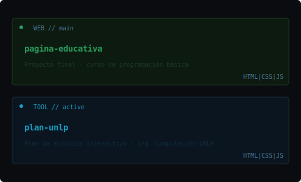

~/M4teee $▋

# Mateo Rivas Aramburu

`Computer Engineering` · `UNLP` · `Buenos Aires, AR`

---

### `> about`

3er año de **Ingeniería en Computación**.  
Foco en software eficiente y escalable — lógica algorítmica, estructuras de datos, optimización de procesos.  

---

### `> stack`

  

---

### `> learning`

  

---

### `> stats`

  

---

### `> projects & stats`

  
  

